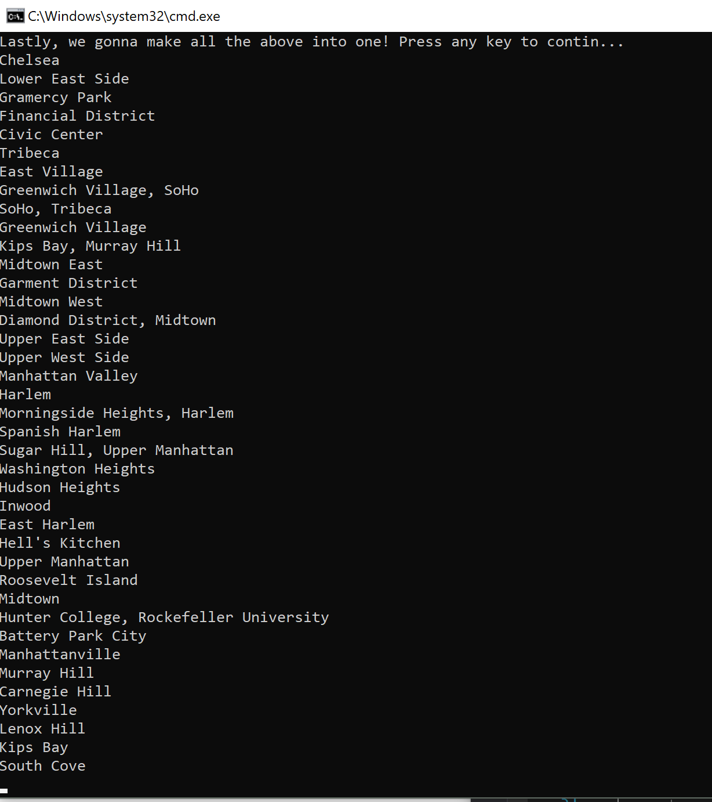

## LINQ
An C#/ASP.NET assigment @ codefellows
**Author:** Rhiannon Mortensen
**Version:** 1.0.0

## Overview
  Console application that shows the manipulation of 
  a JSON file using LINQ.
  This is a large JSON file, which
  is then broken apart by neighborhoods.

## Getting Started
The following is required to run the program:
1. Visual Studio 2017
2. The .NET desktop development workload enabled
3. **NewtonSoftJson (an external NuGet package)**

## Example

## Architecture 
  This is created using ASP.NET Core 2.1 Console Applications.
  *Language:* C#
  *Type of App:* Console App